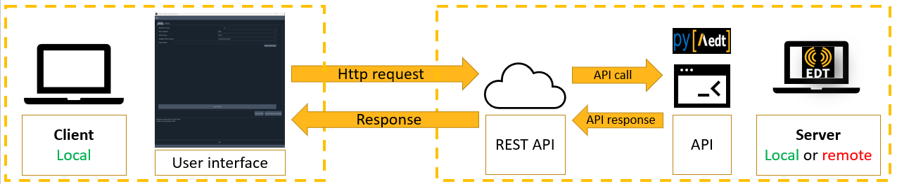
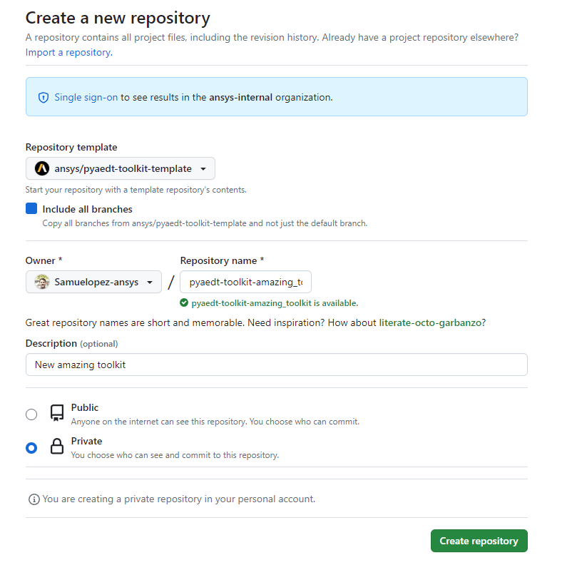

======================
New toolkit guidelines
======================

This repository is a template for any new AEDT toolkit. It standardizes AEDT toolkits implementation.

The **AEDT Toolkit Template** is a working toolkit able to connect to an existing AEDT session, open an existing
AEDT project or initialize a new AEDT session, which should be the basic capability of any toolkit.
In addition, it creates boxes and spheres in random positions as an example of AEDT control.

There are common parts which should not be modified, and others which could be different depending on
the new toolkit implementation. In the following sections, it is defined best practices to implement your own toolkit.

The architecture is split in two main parts:

1. The backend, using `Flask <https://flask.palletsprojects.com/en/2.3.x/>`_. Flask creates a REST API,
which let interact different services by simply doing HTTP requests.

2. The frontend, using `Pyside6 <https://doc.qt.io/qtforpython-6/quickstart.html>`_. Pyside6 has a designer tool
which allows to create user interfaces and it is translated to python directly.

Using Flask, the toolkit becomes interface agnostic, then you can decide change it and use a WebUI for instance
as user interface.

Toolkit architecture
--------------------

Toolkit architecture is defined with the following structure of folders and files:

.. code-block:: text

   pyaedt-toolkits-template
   ├── .github
   │   └──workflows
   │      └── ci_cd.yml
   ├── doc
   │   └──source
   │      ├── Toolkit
   │      │   └── toolkit_docs.rst
   │      └── generic_docs.rst
   ├── src.ansys.aedt.toolkits
   │    └──template
   │       ├── backend
   │       │   ├── common
   │       │   ├── rest_api.py
   │       │   ├── properties.json
   │       │   └── api.py
   │       ├── UI
   │       │   ├── common
   │       │   │   └── toolkit.ui
   │       │   ├── frontend_api.py
   │       │   └── frontend_actions.py
   │       └── run_toolkit.py
   ├── tests
   │   └── tests_files
   ├── pyproject.toml
   └── README.rst

1. `GitHub <https://github.com/ansys/pyaedt-toolkits-template/tree/main/.github>`_ contains the GitHub actions, you do not need to modify these files until the first pull request.

2. `doc <https://github.com/ansys/pyaedt-toolkits-template/tree/main/doc>`_ contains the documentation structure.

3. `template <https://github.com/ansys/pyaedt-toolkits-template/tree/main/src/ansys/aedt/toolkits/template>`_ contains the toolkit code. It is split in backend and frontend. It contains a script called "run_toolkit.py" which launches backend and frontend in two threads.

    3.1 `backend <https://github.com/ansys/pyaedt-toolkits-template/tree/main/src/ansys/aedt/toolkits/template/backend>`_: you can find two main files, **rest_api.py** where the HTTP entrypoints are defined and **api.py** which has the toolkit API.

    3.2 `UI <https://github.com/ansys/pyaedt-toolkits-template/tree/main/src/ansys/aedt/toolkits/template/ui>`_: you can find two main files, **frontend.py** and **frontend_toolkit.py**.

4. `tests <https://github.com/ansys/pyaedt-toolkits-template/tree/main/tests>`_: folder contains the unit test of the backend.

The architecture is defined in the following picture:

Create a new repository in GitHub
---------------------------------

The first step is to create a new repository, it could be Private, Internal, or Public,
you could start making it Private.

You could create this repository inside the `Ansys organization <https://github.com/ansys>`_.
If you're an employee of `Ansys Inc. <https://github.com/ansys>`_,
you can join the organization by visiting
`Join Ansys GitHub Organization. <https://github.com/orgs/ansys/sso>`_.

If you're external to Ansys but want to contribute to adding a new toolkit,
please open an issue on `PyAEDT <https://aedt.docs.pyansys.com/version/stable//>`_.

The naming convention for PyAEDT toolkits is: pyaedt-toolkits-**new_toolkit_name**. In this example, the
new toolkit is called: **amazing toolkit**.

Choose the PyAEDT toolkit template as the repository template and include all branches.

You can change the owner later, Settings > Transfer Ownership. Once the repository is ready for the first pull request,
You can move it to ansys-internal, and if it is ready to be public, you can move it to ansys organization.

Clone the repository locally
----------------------------

Duplicate the new repository in a local repository.

#. Open Git Bash and run these commands:

    .. code:: bash

      cd Repo-Path
      git clone https://github.com/Samuelopez-ansys/pyaedt-toolkit-amazing_toolkit.git

Modify general settings
-----------------------

There are some parts in the repository which are specific for each different toolkit and must be modified manually.

#. Modify the folder name src/ansys/aedt/toolkits/toolkit_name/template to src/ansys/aedt/toolkits/amazing_toolkit.

#. Modify .GitHub/workflows/ci_cd.yml file, from line 16 to 20, with the specific toolkit name.

#. Comment in .GitHub/workflows/ci_cd.yml file, from line 61 to 96, you need these lines to run the unit tests with GitHub actions.

#. Delete tests word in .GitHub/workflows/ci_cd.yml file, line 137, you need this again once the remote tests are working.

#. Modify .GitHub/workflows/ci_cd.yml file, line 89, with the specific toolkit name.

#. Modify doc/source/conf.py file, line 16, with the specific toolkit name.

#. Modify doc/source python files, the most important ones are doc/source/Toolkit/service.rst and doc/source/Toolkit/service_generic.rst.

#. Modify .pre-commit-config.yml file, line 3, with the corresponding UI path.

#. Modify pyproject.toml file, line 7 and 9, with the corresponding toolkit name and description.

#. Modify pyproject.toml file, line 58, with the corresponding toolkit name.

#. Modify pyproject.toml file, from line 61 to 63, with the corresponding toolkit name.

#. Modify run_toolkit.py, from line 12 and 13, with the corresponding toolkit name.

#. Modify backend/backend.py, from line 1 and 6, with the corresponding toolkit name.

#. Modify backend/service.py, from line 3 and 5, with the corresponding toolkit name.

#. Modify backend/common/backend_generic.py, from line 5 and 6, with the corresponding toolkit name.

#. Modify backend/common/logger_handler.py, line 3, with the corresponding toolkit name.

#. Modify backend/common/service_generic.py, from line 6 and 8, with the corresponding toolkit name.

#. Modify backend/common/service_generic.py, from line 5 and 6, with the corresponding toolkit name.

#. Modify frontend/frontend.py, from line 7 and 9, with the corresponding toolkit name.

#. Modify frontend/frontend_toolkit.py, from line 3 and 5, with the corresponding toolkit name.

#. Modify frontend/frontend_generic.py, line 11, with the corresponding toolkit name.

Install default dependencies
----------------------------

You can install in the virtual environment the basic packages to run a PyAEDT toolkit, like pyaedt, flask or pyside6,
the template toml file contains these dependencies and others needed for testing and documentation generation.

Open the terminal console with the virtual environment activated:

.. code:: bash

  pip install .
  pip install .[tests]
  pip install .[doc]
  pip install pre-commit
  pre-commit install

You can do your first pull request to the repository.

Create backend
--------------

The backend part controls all tasks related to the workflow. It should contain code which could be launched without an user interface.

On this repository you have a simple example, you can find in other toolkits more examples of how to develop a backend.
It should be created in src/ansys/aedt/toolkits/new_toolkit_name/backend.

The backend structure contains three files related to this specific toolkit, **properties.json, service.py and backend.py.**
There is a **common folder** which contains generic methods useful for all toolkits, like the logger handler or launch and release AEDT services.

Properties.json
~~~~~~~~~~~~~~~

This file contains the data shared between methods in the backend. This toolkit is creating a box or an sphere in HFSS in random positions, and the dimensions are multiplied by a value.
Then the only toolkit inputs are the geometry type and the multiplier.

Api.py
~~~~~~~~~~

This file contains all the logic needed. For this example is a simple python file, but it can be a more complex structure with classes if it is needed.

This file must work independently, it means, you do not need a user interface to run the full workflow of the toolkit.
As an example, you can see in the docstring of the Toolkit class, how to use the toolkit in a python terminal.

Rest_api.py
~~~~~~~~~~~

Once you have a service working, you need to define the entrypoints. It means, you need to create the url commands to allow the communication between frontend and backend.
If you see this file, it contains only the entrypoint corresponding to this toolkit, but if you go to common backend_generic.py, you can find the generic entrypoints.

Test backend
~~~~~~~~~~~~

You can test the backend using tools like Postman or directly the browser.
You need to update the toolkit package modifications in the virtual environment:

.. code:: bash

  pip install .

And run the file backend.py.

Create unit test
----------------

If the repository has a backend, you should create unit test for each different methods, this increase the maintainability of your code.
The tests are in the folder **tests**.

This repository has two unit test defined, the first one **test_00_service_generic.py** is testing the generic services and you do not need to modify it.
The second one, **test_01_service_toolkit.py** is an example of how you can create the unit test for your toolkit.

You can run locally the unit tests if you installed the [tests] dependencies.

If you push these modifications, GitHub actions try to connect to a runner called *pyaedt-toolkits*, please submit an issue
on the `PyAEDT Issues <https://github.com/pyansys/PyAEDT/issues>`_ page to give access to your repository to run the unit test remotely.
If you want to use these runners, you need to change the ownership of the repository to ansys-internal.

Create user interface
---------------------

If you installed the default dependencies, you installed pyside6, which allows to create user interfaces.
If you prefer other frontend libraries or even develop the frontend in a WebUI, you can do it because the backend is ready from the previous steps.

If you use Pyside6, the general guidelines for user interface implementation are:

#. Open the designer.

    .. code:: bash

       pyside6-designer

#. Open the user interface template (frontend/common/toolkit).

#. Modify it and save it.

#. Create a new python script, which contains these modifications.

    .. code:: bash

        pyside6-uic src\ansys\aedt\toolkits\new_toolkit_name\ui\common\toolkit.ui -o src\ansys\aedt\toolkits\new_toolkit_name\ui\common\frontend_ui.py

#. Create your script to control this user interface, you can use frontend\frontend.py as a template.

Create documentation
--------------------

The documentation is created automatically using Sphinx.

You need to define the structure in doc/source/index.rst.

#. You can build the documentation locally:

    .. code:: bash

        cd doc\source
        create_documentation.bat

#. To publish the documentation online, you need to submit an issue on the `PyAEDT Issues <https://github.com/pyansys/PyAEDT/issues>`_ page.

Run the toolkit
---------------

In order to run the toolkit you need to run the backend and then run the frontend.

You have the file run_toolkit.py which is doing this task. Then you can use this file to launch the toolkit directly.

Add toolkit in PyAEDT
---------------------

You can be install the toolkit inside AEDT using PyAEDT.
Create an issue on the `PyAEDT Issues <https://github.com/pyansys/PyAEDT/issues>`_ page and contributors can add it if the repository is public.
